### Task Management System

### Features.
User Management : Create View, Edit and Delete user/users \n
Task Management : Create View Edit and Delete task/tasks \n
Navigation between user, tasks and assignments \n
Responsive designs \n

### SCREENSHOTS

div align="center">

### User Management
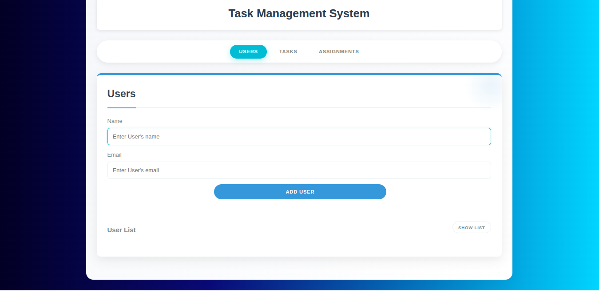

### Addig the user Tracy

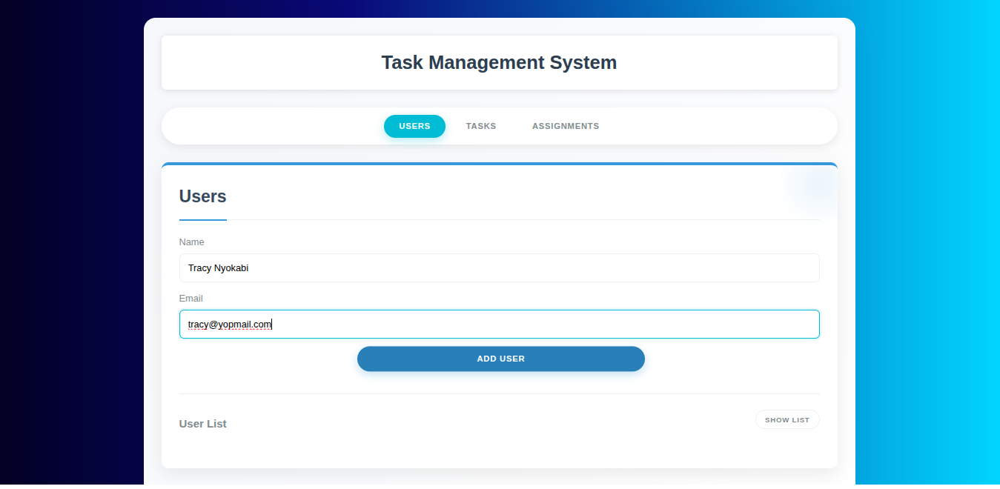

### Updating the user in list

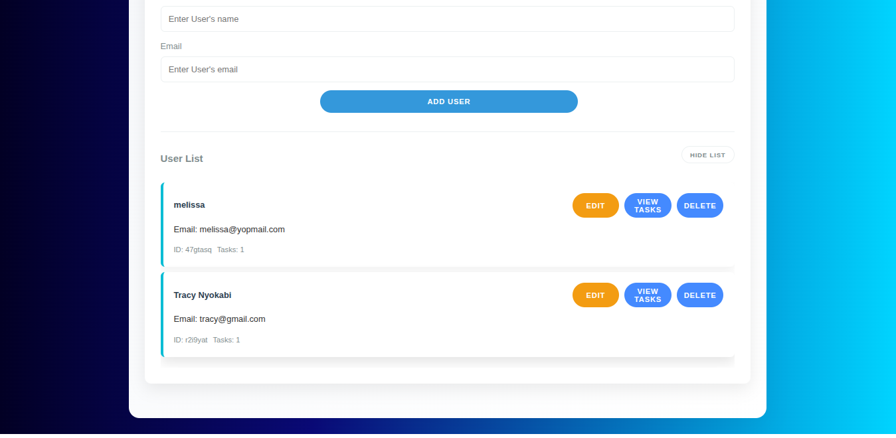

### Delete a user

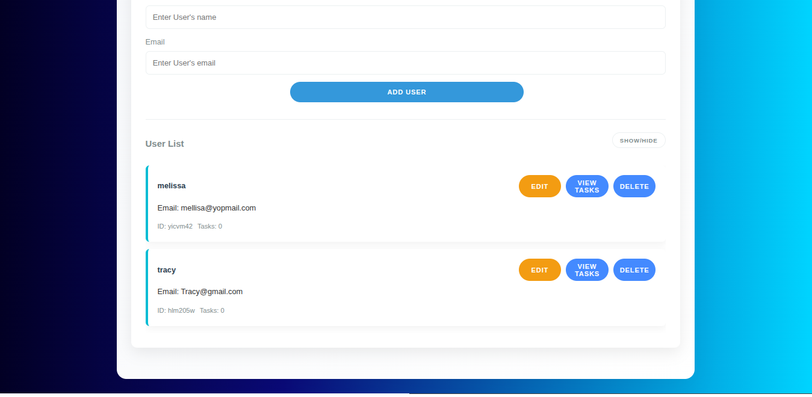

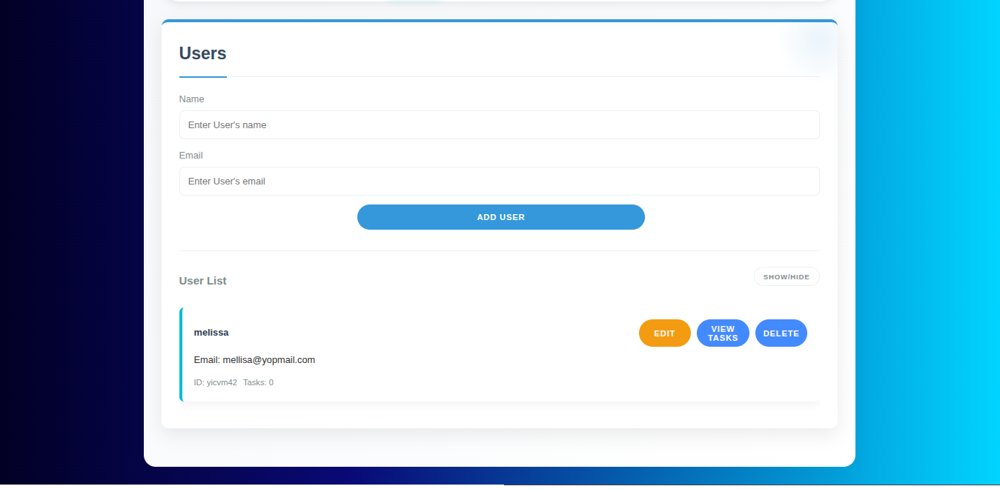

### Task Management
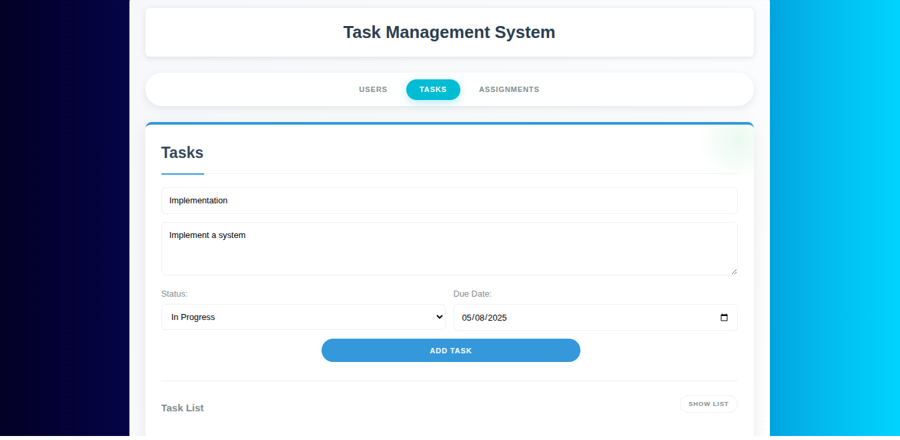

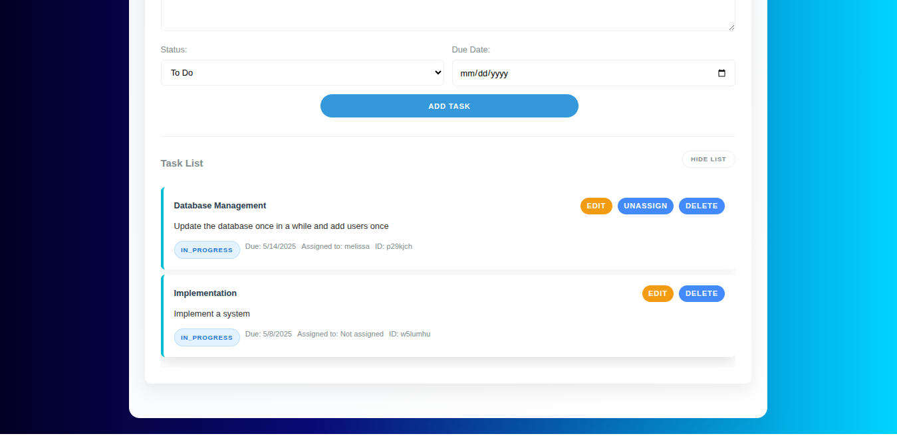

###  Updating the task in list

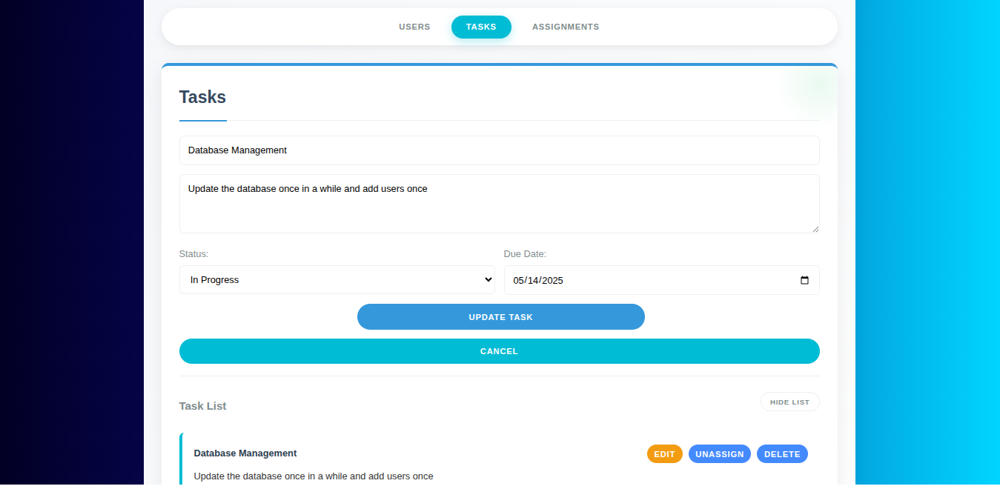

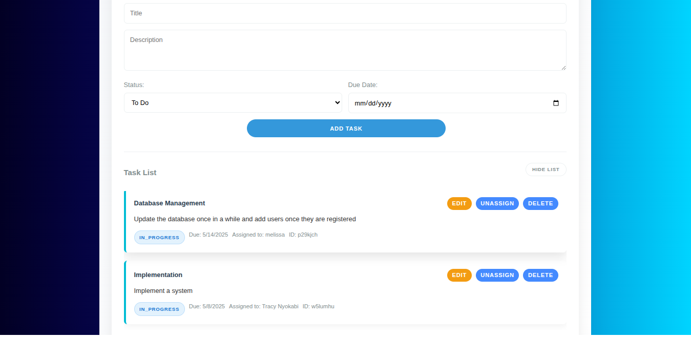

### Delete a task 
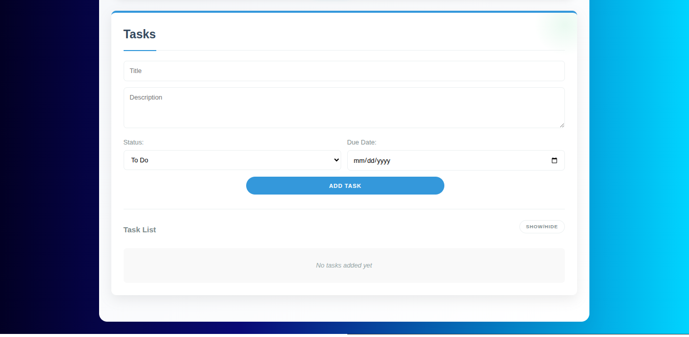

### Task Assignment
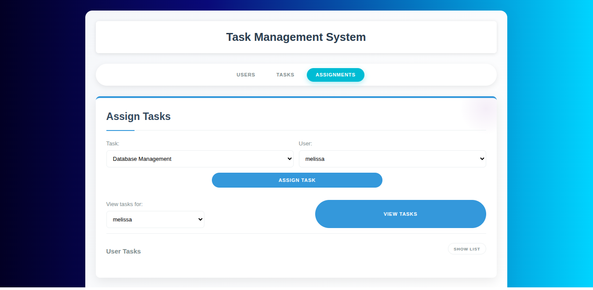

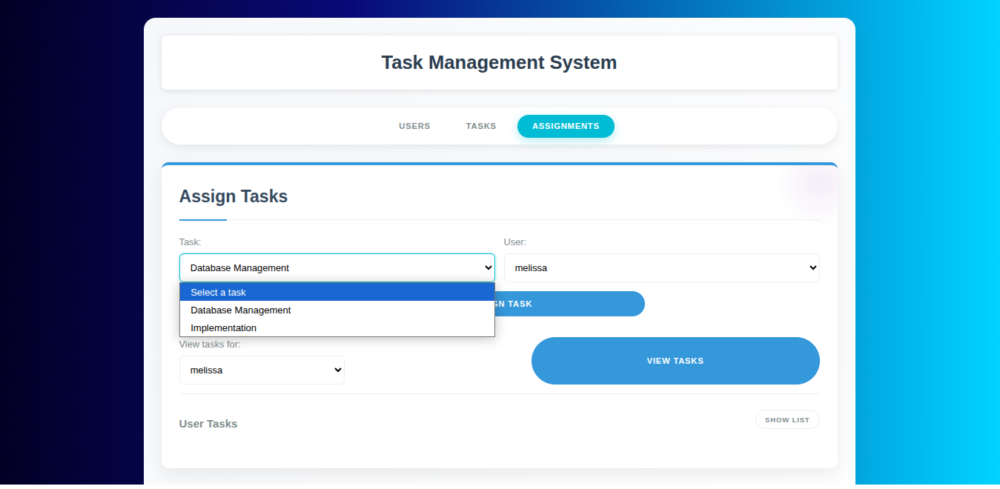

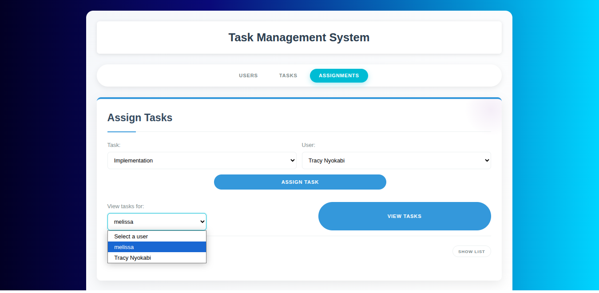

#### Unassign a task

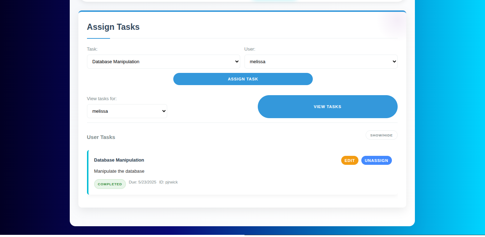

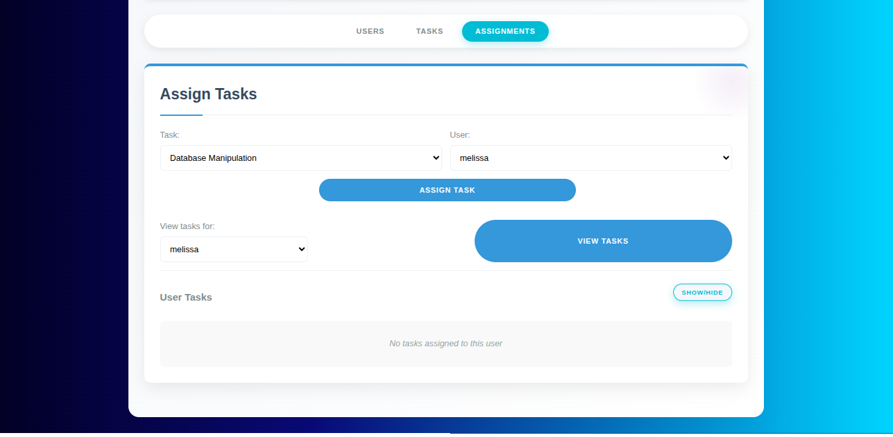

